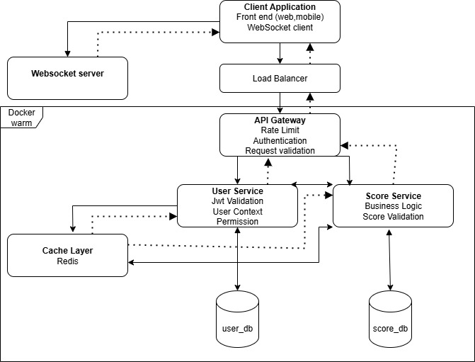

# Live Scoreboard API Service

## Overview

This module provides a real-time scoreboard system that displays the top 10 user scores with live updates. The system ensures secure score updates through proper authentication and authorization mechanisms to prevent malicious score manipulation.


## Execution Flow Diagram



The diagram above illustrates the complete flow from user action to real-time scoreboard updates across all connected clients.

## Architecture

The Live Scoreboard API Service consists of the following core components:

- **Score Management Service**: Handles score updates and validation
- **Real-time Communication Layer**: WebSocket connections for live updates  
- **Authentication & Authorization**: JWT-based security with rate limiting
- **Caching Layer**: Redis-based caching for optimal performance
- **Database Layer**: Persistent score storage

## API Specifications

### Base URL
```
https://api.yourapp.com/v1
```

### Authentication
All API endpoints require JWT authentication via the `Authorization` header:
```
Authorization: Bearer <jwt_token>
```

### Endpoints

## User Service
#### 1. Login
```typescript
POST /user/login

Headers:
    - Content-Type: application/json

Body:
{
    "username": "string",
    "password": "string",
}

Response:
{
  "success": true,
  "data": {
    "access_token":"string",
    "refresh_token":"string",
    "token_type": "Bearer",
    "expires_in": 3600
  }
}
```

#### 2. Refresh token
```typescript
POST /user/refresh-token

Headers:
    - Authorization: Bearer <jwt_token>
    - Content-Type: application/json

Body:
{
    "refresh_token": "string",
    "client_id":"string",
    "client_secret":"string",
    "grant_type":"refresh_token"
}

Response:
{
  "success": true,
  "data": {
    "access_token":"string",
    "refresh_token":"string",
    "token_type": "Bearer",
    "expires_in": 3600
  }
}
```

#### 3. Register
```typescript
POST /user/register

Headers:
    - Content-Type: application/json

Body:
{
    "username": "string",
    "password": "string",
    "confirm_password": "string",
}

Response:
{
  "success": true,
  "data": {
    "username": "string",
    "password": "string" // encrypt
  }
}
```

#### 4. Update
```typescript
PUT /user/register

Headers:
    - Content-Type: application/json

Body:
{
    "password": "string",
    "confirm_password": "string",
}

Response:
{
  "success": true,
  "data": {
    "username": "string",
    "password": "string" // encrypt
  }
}
```

## Score Service
#### 1. Get Top 10 Leaderboard (dynamic limit top of leaderboard)
```typescript
GET /scoreboard/top?limit=10

Response:
{
  "success": true,
  "data": {
    "leaderboard": [
      {
        "userId": "string",
        "username": "string",
        "score": number,
        "rank": number,
        "lastUpdated": "ISO8601 timestamp"
      }
    ],
    "lastRefresh": "ISO8601 timestamp"
  }
}
```

#### 2. Update User Score
```typescript
POST /scoreboard/update-score

Headers:
- Authorization: Bearer <jwt_token>
- Content-Type: application/json

Body:
{
  "actionId": "string",        // Unique action identifier
  "actionType": "string",      // Type of action performed
  "scoreIncrement": number,    // Points to add (must be positive)
  "timestamp": "ISO8601",      // When action was completed
  "signature": "string"        // HMAC signature for verification
}

Response:
{
  "success": true,
  "data": {
    "userId": "string",
    "newScore": number,
    "scoreIncrement": number,
    "newRank": number,
    "previousRank": number
  }
}
```

#### 3. Get User Score Details
```typescript
GET /scoreboard/user/:userId

Response:
{
  "success": true,
  "data": {
    "userId": "string",
    "username": "string",
    "currentScore": number,
    "currentRank": number,
    "totalActions": number,
    "lastActionDate": "ISO8601 timestamp"
  }
}
```
## Websocket Server
#### 1. WebSocket Connection for Real-time Updates
```typescript
WebSocket: /ws/scoreboard

Connection Headers:
- Authorization: Bearer <jwt_token>

Events Received:
{
  "type": "LEADERBOARD_UPDATE",
  "data": {
    "leaderboard": [...],
    "changedUsers": ["userId1", "userId2"],
    "timestamp": "ISO8601"
  }
}

{
  "type": "USER_RANK_CHANGE",
  "data": {
    "userId": "string",
    "oldRank": number,
    "newRank": number,
    "scoreChange": number
  }
}
```

## TypeScript Interfaces

```typescript
// Core Types
interface User {
  userId: string;
  username: string;
  password: string;
  createdAt: Date;
}

interface ScoreEntry {
  userId: string;
  username: string;
  score: number;
  rank: number;
  lastUpdated: Date;
}

interface ScoreUpdateRequest {
  actionId: string;
  actionType: string;
  scoreIncrement: number;
  timestamp: string;
  signature: string;
}

interface ScoreUpdateResponse {
  userId: string;
  newScore: number;
  scoreIncrement: number;
  newRank: number;
  previousRank: number;
}

interface LeaderboardResponse {
  leaderboard: ScoreEntry[];
  lastRefresh: Date;
}

// WebSocket Event Types
interface WebSocketEvent {
  type: 'LEADERBOARD_UPDATE' | 'USER_RANK_CHANGE' | 'CONNECTION_STATUS';
  data: any;
  timestamp: Date;
}

interface LeaderboardUpdateEvent extends WebSocketEvent {
  type: 'LEADERBOARD_UPDATE';
  data: {
    leaderboard: ScoreEntry[];
    changedUsers: string[];
    timestamp: Date;
  };
}

interface UserRankChangeEvent extends WebSocketEvent {
  type: 'USER_RANK_CHANGE';
  data: {
    userId: string;
    oldRank: number;
    newRank: number;
    scoreChange: number;
  };
}
```

## Security Measures

### 1. Authentication & Authorization
- **JWT Tokens**: All requests must include valid JWT tokens
- **Token Expiration**: Tokens expire after 24 hours
- **Refresh Mechanism**: Automatic token refresh for active sessions

### 2. Score Update Validation
- **HMAC Signature**: Each score update includes HMAC-SHA256 signature
- **Action ID Uniqueness**: Prevents duplicate score submissions
- **Timestamp Validation**: Rejects requests older than 5 minutes
- **Rate Limiting**: Maximum 10 score updates per minute per user

### 3. Anti-Fraud Measures
- **Score Increment Limits**: Maximum 1000 points per single action
- **Daily Score Caps**: Maximum 50,000 points per user per day
- **Suspicious Activity Detection**: Flags unusual scoring patterns
- **Action Type Validation**: Only predefined action types accepted

### 4. Request Signature Generation
```typescript
// Modern signature generation using Web Crypto API and jose library
import { SignJWT, jwtVerify } from 'jose';
import { createHash, createHmac } from 'node:crypto';

interface ScoreUpdatePayload {
  actionId: string;
  actionType: string;
  scoreIncrement: number;
  timestamp: string;
  userId: string;
}

// Client-side signature generation (using Web Crypto API)
async function generateSignature(
  payload: ScoreUpdatePayload, 
  secretKey: string
): Promise<string> {
  const message = `${payload.actionId}:${payload.actionType}:${payload.scoreIncrement}:${payload.timestamp}:${payload.userId}`;
  
  // Using Node.js crypto for server-side
  return createHmac('sha256', secretKey)
    .update(message)
    .digest('hex');
}

// Modern JWT creation with jose library
async function createSecureJWT(payload: object, secret: Uint8Array): Promise<string> {
  return await new SignJWT(payload)
    .setProtectedHeader({ alg: 'HS256' })
    .setIssuedAt()
    .setExpirationTime('24h')
    .sign(secret);
}

// JWT verification with jose library
async function verifyJWT(token: string, secret: Uint8Array) {
  const { payload } = await jwtVerify(token, secret);
  return payload;
}
```

## Database Schema (Prisma ORM)

### Prisma Schema Definition
```prisma
// schema.prisma
generator client {
  provider = "prisma-client-js"
}

datasource db {
  provider = "postgresql"
  url      = env("DATABASE_URL")
}

model User {
  id        String   @id @default(cuid())
  username  String   @unique @db.VarChar(50)
  createdAt DateTime @default(now()) @map("created_at")
  updatedAt DateTime @updatedAt @map("updated_at")
  
  // Relations
  score        Score?
  scoreHistory ScoreHistory[]
  
  @@map("users")
}

model Score {
  userId         String   @id @map("user_id")
  currentScore   BigInt   @default(0) @map("current_score")
  totalActions   Int      @default(0) @map("total_actions")
  lastActionDate DateTime? @map("last_action_date")
  createdAt      DateTime @default(now()) @map("created_at")
  updatedAt      DateTime @updatedAt @map("updated_at")
  
  // Relations
  user User @relation(fields: [userId], references: [id], onDelete: Cascade)
  
  @@map("scores")
}

model ScoreHistory {
  id              String   @id @default(cuid())
  userId          String   @map("user_id")
  actionId        String   @unique @map("action_id") @db.VarChar(255)
  actionType      String   @map("action_type") @db.VarChar(100)
  scoreIncrement  Int      @map("score_increment")
  scoreBefore     BigInt   @map("score_before")
  scoreAfter      BigInt   @map("score_after")
  createdAt       DateTime @default(now()) @map("created_at")
  
  // Relations
  user User @relation(fields: [userId], references: [id], onDelete: Cascade)
  
  @@index([userId])
  @@index([actionId])
  @@map("score_history")
}

// Indexes for performance
model LeaderboardCache {
  id           String   @id @default(cuid())
  userId       String   @map("user_id")
  username     String   @db.VarChar(50)
  currentScore BigInt   @map("current_score")
  rank         Int
  lastUpdated  DateTime @default(now()) @map("last_updated")
  
  @@unique([rank])
  @@index([currentScore(sort: Desc)])
  @@map("leaderboard_cache")
}
```

## Error Handling

### Error Response Format
```typescript
{
  "success": false,
  "error": {
    "code": "ERROR_CODE",
    "message": "Human readable error message",
    "details": "Additional error details",
    "timestamp": "ISO8601 timestamp"
  }
}
```

### Common Error Codes
- `INVALID_TOKEN`: JWT token is invalid or expired
- `INVALID_SIGNATURE`: HMAC signature verification failed
- `DUPLICATE_ACTION`: Action ID already processed
- `RATE_LIMIT_EXCEEDED`: Too many requests from user
- `INVALID_SCORE_INCREMENT`: Score increment exceeds limits
- `TIMESTAMP_TOO_OLD`: Request timestamp is too old

The backend engineering team should prioritize security measures and performance optimization during implementation.